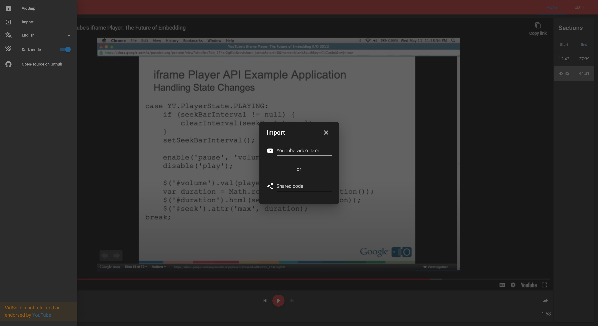
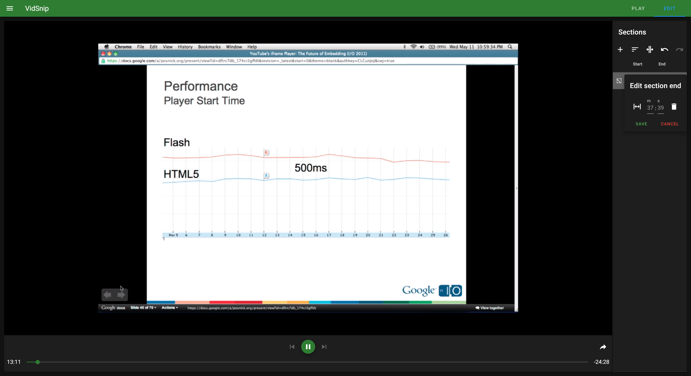
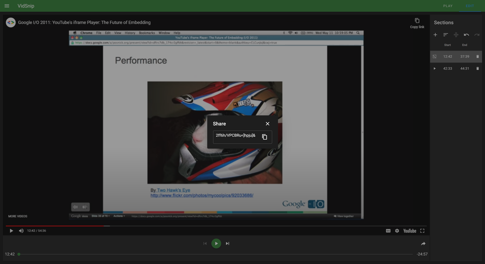
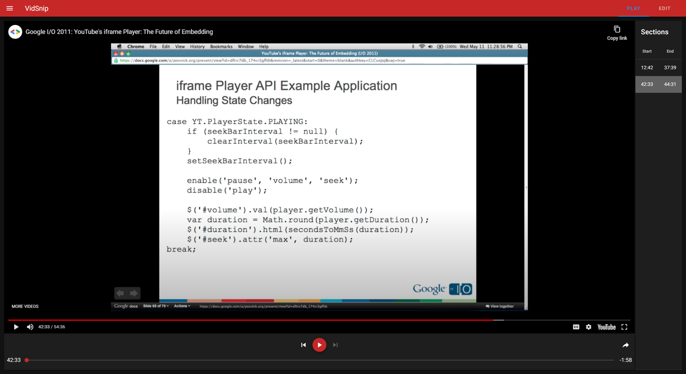

# VidSnip

> Cut youtube videos into sections so that only the desired times are played. 
> Afterwards a code can be generated to save the edited video which can be freely shared so that
> no download is needed. This application can be helpful in presentations when only specific parts of
> a video should be played without the need of rerendering or active moderation while presenting. 

## Screenshots

#### Overview

#### Edit section

#### Shareable code 

#### Play mode

## License

Licensed under the [AGPL-3.0](LICENSE) License.
